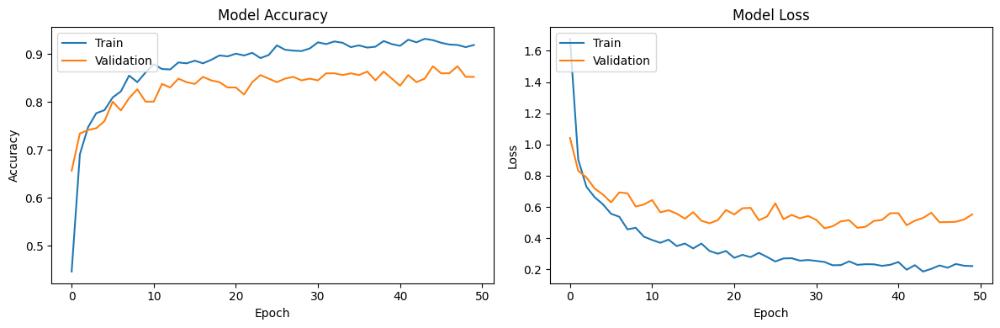
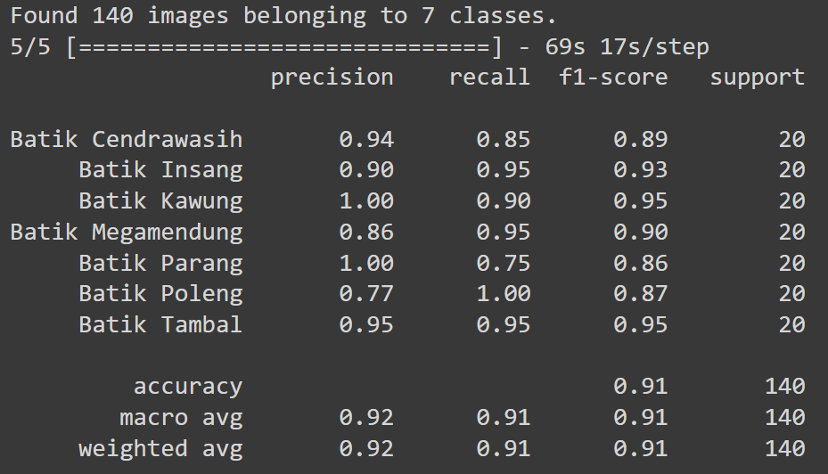
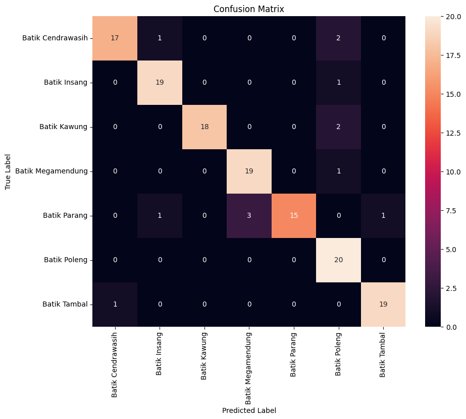

<p align="center">
  <h1 align="center"><b>Machine Learning</b></h1>
</p>

# **Table of Contents**

1. [Replication Steps](#replication-steps)
2. [Xception Model](#xception-model)
3. [Result](#result)
4. [References](#references)

## **Replication Steps**

To replicate the project:

1. **Download the dataset and model:** [Google Drive Link](https://drive.google.com/drive/folders/1P2fe_RnuaxFPFVToTDKOiRzw7f_k30Q5)

2. **Mount Google Drive in Colab:**

```python
from google.colab import drive
drive.mount('/content/drive')
```

3. **Run the notebook:** Execute all cells in the provided notebook file.

## **Xception Model**

Xception is a deep learning architecture that builds on the idea of depthwise separable convolutions. It stands for Extreme Inception, and it's designed to be more efficient and powerful than the older Inception models. Here’s a relaxed guide to how it works:

1. **The Basics: Convolutions**

To start, let’s talk about convolutions. In neural networks, a convolution layer helps to scan and learn patterns from the input image using filters (or kernels). Think of it like looking at a picture through different shaped lenses to see various details. Regular convolutions learn these details (like edges, textures) all at once.

2. **Separable Convolutions**

Now, depthwise separable convolutions break this down into two simpler steps:

* **Depthwise Convolution:** Instead of applying one filter to all color channels together, we apply one filter to each color channel separately. It’s like examining red, green, and blue parts of the image one at a time. This step simplifies the learning process and reduces the number of calculations needed.

* **Pointwise Convolution:** After looking at each channel separately, we use a 1x1 convolution to mix these separate insights together. It’s like combining the red, green, and blue perspectives to form a full-color understanding.

3. **Mathematics 😎**

Here’s a quick peek into the math:

**Regular Convolution**

* If we have an input of size $H \times W \times D_{in}$ (height, width, depth of input channels), and a filter of size $F \times F \times D_{in} \times D_{out}$, the output size will be $H \times W \times D_{out}$.

* The number of operations is $H \times W \times F^2 \times D_{in} \times D_{out}$.

**Depthwise Separable Convolution**

* **Depthwise:** We use $D_{in}$ filters of size $F \times F$, one for each input channel. This gives us $H \times W \times D_{in}$ outputs, with operations $H \times W \times F^2 \times D_{in}$.

* **Pointwise:** Then, we apply $1 \times 1 \times D_{in} \times D_{out}$ filter to combine these, resulting in $H \times W \times D_{out}$, with operations $H \times W \times D_{in} \times D_{out}$.

Overall, we get:

$H \times W \times F^2 \times D_{in} + H \times W \times D_{in} \times D_{out}$

$H \times W \times D_{in} (F^2 + D_{out})$

This is fewer operations than a regular convolution, making it faster and more efficient.

4. **Xception Architecture**


[Xception Architecture Source](https://arxiv.org/abs/1610.02357)

Xception takes this depthwise separable convolution idea to the extreme. Instead of just using it occasionally like in Inception, Xception uses it throughout the network. The architecture has a series of these layers stacked together:

* **Entry Flow:** The first part, where initial features are extracted using separable convolutions.
  
* **Middle Flow:** This is repeated multiple times to dig deeper into the image and learn more complex patterns.
  
* **Exit Flow:** The final part that gathers all the learned features to make predictions.

Each of these flows has layers connected by something called residual connections, which are like shortcuts that help the model learn better and faster.

5. **Why It is Cool?**

The real win with Xception is how it efficiently uses its parameters. Because it simplifies the convolutions, it can use the same number of parameters as older models (like Inception V3) but get better performance. Imagine cleaning our house with a more effective vacuum—less effort, but a cleaner house.

6. **Final Thoughts**

Xception shows that by separating and simplifying the tasks that convolutions do, we can build a faster and more powerful model. It’s like turning a complicated cooking recipe into a series of easy-to-follow steps that still make a delicious meal.

In short, Xception's genius lies in breaking down the problem into simpler pieces, handling them separately, and then combining the results in a smart way to get the job done better and faster.

## Result



The plot of our Xception model's training history reveals promising performance, with training accuracy stabilizing around 92-94% and validation accuracy at 85-87%. While there is a slight gap indicating some overfitting, the model shows good generalization on unseen data. This suggests a robust model but leaves room for further tuning to close the gap.



Our Xception model demonstrates strong performance across the seven batik classes. Precision, recall, and F1-scores are high, particularly for Batik Kawung and Batik Parang, which achieve perfect precision and recall. The overall accuracy is 91%, with a macro average F1-score of 91% respectively. This suggests that the model effectively distinguishes between different batik patterns with high reliability.



The confusion matrix highlights the effectiveness of our Xception model in classifying batik patterns. Most classes are well-predicted with few misclassifications. Notable observations include:

* **Batik Cendrawasih:** High accuracy with minor confusion with Batik Tambal.

* **Batik Parang:** Some misclassifications mainly with Batik Megamendung.

* **Batik Poleng:** Perfect classification with no mispredictions.

Overall, the model shows strong performance with most patterns correctly classified, reflecting its ability to accurately differentiate between diverse batik styles.

## References

* TensorFlow Documentation: https://www.tensorflow.org/

* Keras API Reference: https://keras.io/
