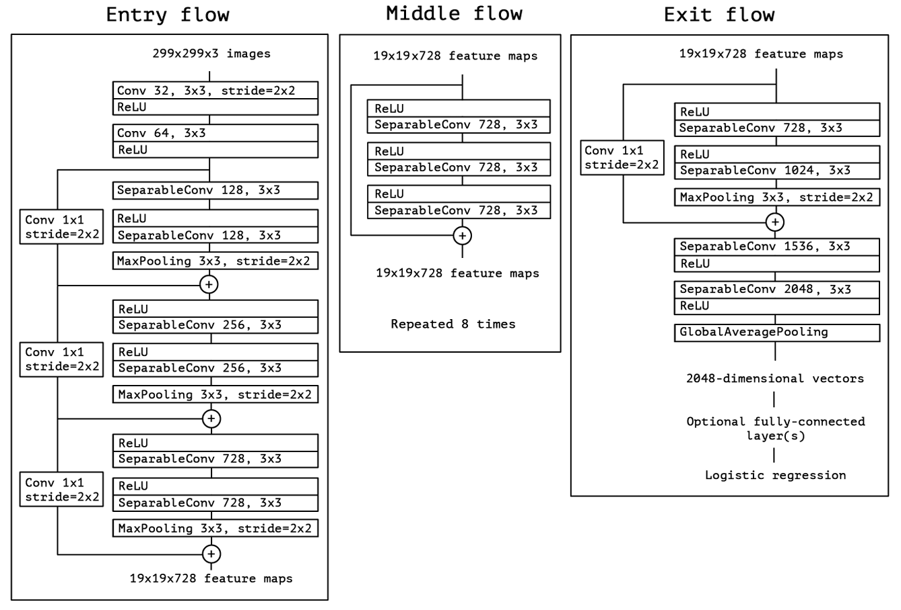

<p align="center">
  <h1 align="center"><b>Batikpedia.Id</b></h1>
</p>

## **Table of Contents**

1. [Introduction](#introduction)
2. [Libraries and Tools](#libraries-and-tools)
3. [Data Preprocessing](#data-preprocessing)
4. [Model Building](#model-building)
5. [Model Evaluation](#model-evaluation)
6. [Model Prediction](#model-prediction)
7. [Replication Steps](#replication-steps)
8. [References](#references)

## **Introduction**

In today's digital era, many people are unaware of the rich history and varieties of Batik patterns. Micro, Small, and Medium Enterprises (SMEs) selling Batik products often struggle to reach a wider market. Additionally, there is a lack of interactive technology that allows consumers to visualize how different Batik designs might look on them before making a purchase.

**Batikpedia** aims to bridge these gaps by using mobile development, machine learning, and cloud computing to educate users, promote Batik SMEs, and enhance the shopping experience with augmented reality features. This project focuses on developing a mobile application that can classify Batik patterns, provide historical information, and support SMEs, thereby making Batik culture accessible and engaging for a global audience.

## **Libraries and Tools**

The following libraries and tools are used in this project:

```python
import matplotlib.pyplot as plt
from sklearn.metrics import classification_report, confusion_matrix
import pandas as pd
import os
import random
from PIL import Image
from collections import defaultdict
import seaborn as sns
from tensorflow import keras
import tensorflow as tf
from tensorflow.keras.preprocessing.image import ImageDataGenerator
import numpy as np
from tensorflow.keras.applications import Xception
from tensorflow.keras import Model
from tensorflow.keras.layers import Input, Dropout, Dense
from tensorflow.keras.models import Sequential, load_model
from tensorflow.keras.callbacks import ModelCheckpoint
from IPython.display import display, clear_output
import ipywidgets as widgets
from io import BytesIO
import zipfile
```

## **Data Preprocessing**

### **Data Extraction**

```python
# Uncomment and adjust the paths as needed
# zip_path = '/content/drive/My Drive/batikdataset.zip'
# extract_path = '/content/drive/MyDrive'

# with zipfile.ZipFile(zip_path, 'r') as zip_ref:
#     zip_ref.extractall(extract_path)
```

### **Data Directory Setup**

Define the directories for training and testing data:

```python
train_dir = "/content/drive/MyDrive/batikdataset/TRAIN"
test_dir = "/content/drive/MyDrive/batikdataset/TEST"
```

### **Display Label Counts**

Count and display the number of images per label:

```python
def count_images_per_label(dir_path):
    label_counts = defaultdict(int)
    for label in os.listdir(dir_path):
        label_path = os.path.join(dir_path, label)
        if os.path.isdir(label_path):
            for image_name in os.listdir(label_path):
                if image_name.endswith(('png', 'jpg', 'jpeg')):
                    label_counts[label] += 1
    return label_counts

def display_label_counts(dir_path):
    label_counts = count_images_per_label(dir_path)
    for label, count in label_counts.items():
        print(f"Label: {label}, Jumlah Gambar: {count}")

display_label_counts(train_dir)
```

### **Display Random Images**

Display random images from the dataset:

```python
def display_random_images(dir_path, num_images, images_per_row):
    images, labels = get_images_and_labels(dir_path)

    if num_images > len(images):
        print(f"Hanya ada {len(images)} gambar di direktori {dir_path}. Menampilkan semua gambar yang ada.")
        num_images = len(images)

    random_indices = random.sample(range(len(images)), num_images)
    selected_images = [images[i] for i in random_indices]
    selected_labels = [labels[i] for i in random_indices]

    num_rows = (num_images + images_per_row - 1) // images_per_row
    fig, axes = plt.subplots(num_rows, images_per_row, figsize=(images_per_row * 4, num_rows * 4))
    axes = axes.flatten()

    for img_path, label, ax in zip(selected_images, selected_labels, axes):
        img = Image.open(img_path)
        ax.imshow(img)
        ax.set_title(label)
        ax.axis('off')

    for i in range(len(selected_images), len(axes)):
        axes[i].axis('off')

    plt.tight_layout()
    plt.show()

display_random_images(train_dir, num_images=30, images_per_row=5)
```

### **Data Generators**

Create data generators for training and validation:

```python
def train_val_generators(train_dir):
    train_datagen = ImageDataGenerator(rescale=1/255.0,
                                       shear_range=0.2,
                                       zoom_range=0.4,
                                       fill_mode='nearest',
                                       validation_split=0.2)

    train_generator = train_datagen.flow_from_directory(directory=train_dir,
                                                        batch_size=32,
                                                        class_mode='categorical',
                                                        target_size=(224, 224),
                                                        subset="training")

    validation_datagen = ImageDataGenerator(rescale=1/255.0,
                                            validation_split=0.2)

    validation_generator = validation_datagen.flow_from_directory(directory=train_dir,
                                                                  batch_size=32,
                                                                  class_mode='categorical',
                                                                  target_size=(224, 224),
                                                                  subset="validation")
    return train_generator, validation_generator

train_generator, validation_generator = train_val_generators(train_dir)
```

## **Model Building**

### **Xception Model**

Xception is a deep learning architecture that builds on the idea of depthwise separable convolutions. It stands for Extreme Inception, and it's designed to be more efficient and powerful than the older Inception models. Here’s a relaxed guide to how it works:

1. **The Basics: Convolutions**

To start, let’s talk about convolutions. In neural networks, a convolution layer helps to scan and learn patterns from the input image using filters (or kernels). Think of it like looking at a picture through different shaped lenses to see various details. Regular convolutions learn these details (like edges, textures) all at once.

2. **Separable Convolutions**

Now, depthwise separable convolutions break this down into two simpler steps:

* **Depthwise Convolution:** Instead of applying one filter to all color channels together, we apply one filter to each color channel separately. It’s like examining red, green, and blue parts of the image one at a time. This step simplifies the learning process and reduces the number of calculations needed.

* **Pointwise Convolution:** After looking at each channel separately, we use a 1x1 convolution to mix these separate insights together. It’s like combining the red, green, and blue perspectives to form a full-color understanding.

3. **Xception Architecture**



*Figure 1: Xception Architecture.* 

[Source: "Xception Model Architecture"]([https://link-to-paper.com](https://arxiv.org/abs/1610.02357))

Xception takes this depthwise separable convolution idea to the extreme. Instead of just using it occasionally like in Inception, Xception uses it throughout the network. The architecture has a series of these layers stacked together:

* **Entry Flow:** The first part, where initial features are extracted using separable convolutions.
  
* **Middle Flow:** This is repeated multiple times to dig deeper into the image and learn more complex patterns.
  
* **Exit Flow:** The final part that gathers all the learned features to make predictions.

Each of these flows has layers connected by something called residual connections, which are like shortcuts that help the model learn better and faster.

4. **Why It is Cool?**

The real win with Xception is how it efficiently uses its parameters. Because it simplifies the convolutions, it can use the same number of parameters as older models (like Inception V3) but get better performance. Imagine cleaning your house with a more effective vacuum—less effort, but a cleaner house.

5. **Final Thoughts**

Xception shows that by separating and simplifying the tasks that convolutions do, we can build a faster and more powerful model. It’s like turning a complicated cooking recipe into a series of easy-to-follow steps that still make a delicious meal.

In short, Xception's genius lies in breaking down the problem into simpler pieces, handling them separately, and then combining the results in a smart way to get the job done better and faster.

#### **Load Pre-trained Xception**

```python
tf.keras.backend.clear_session()

def create_pre_trained_model():
    pre_trained_model = Xception(
        input_shape=(224, 224, 3),
        include_top=False,
        weights='imagenet',
        pooling="max"
    )

    pre_trained_model.trainable = False

    return pre_trained_model

pre_trained_model = create_pre_trained_model()

pre_trained_model.summary()
```

#### **Final Model**

Create the final model with additional layers:

```python
tf.keras.backend.clear_session()

def create_final_model(pre_trained_model):
    inputs = Input(shape=(224, 224, 3))
    x = pre_trained_model(inputs)
    x = Dropout(0.3)(x)
    outputs = Dense(units=7, activation='softmax')(x)
    model = Model(inputs=inputs, outputs=outputs)

    model.compile(optimizer="adam",
                  loss="categorical_crossentropy",
                  metrics=["accuracy"])

    return model

model = create_final_model(pre_trained_model)

model.summary()
```

### **Training the Model**

Train the model with checkpoints:

```python
checkpoint_filepath = '/content/drive/MyDrive/batik_checkpoint/xception_checkpoint.h5'
model_checkpoint_callback = ModelCheckpoint(
    filepath=checkpoint_filepath,
    save_weights_only=True,
    monitor='val_accuracy',
    mode='max',
    save_best_only=True)

history = model.fit(
    train_generator,
    validation_data=validation_generator,
    epochs=50,
    callbacks=[model_checkpoint_callback]
)
```

### **Plot Training History**

```python
def plot_training_history(history):
    plt.figure(figsize=(12, 4))
    plt.subplot(1, 2, 1)
    plt.plot(history.history['accuracy'])
    plt.plot(history.history['val_accuracy'])
    plt.title('Model Accuracy')
    plt.ylabel('Accuracy')
    plt.xlabel('Epoch')
    plt.legend(['Train', 'Validation'], loc='upper left')

    plt.subplot(1, 2, 2)
    plt.plot(history.history['loss'])
    plt.plot(history.history['val_loss'])
    plt.title('Model Loss')
    plt.ylabel('Loss')
    plt.xlabel('Epoch')
    plt.legend(['Train', 'Validation'], loc='upper left')

    plt.tight_layout()
    plt.show()

plot_training_history(history)
```

## **Model Evaluation**

### **Load Best Model and Evaluate**

```python
model.load_weights(checkpoint_filepath)

model.save('/content/drive/MyDrive/xception_model.h5')
```

### **Generate Classification Report**

```python
test_datagen = ImageDataGenerator(rescale=1/255.0)
test_generator = test_datagen.flow_from_directory(directory=test_dir,
                                                  batch_size=32,
                                                  class_mode='categorical',
                                                  target_size=(224, 224),
                                                  shuffle=False)

predictions = model.predict(test_generator, verbose=1)
predicted_classes = np.argmax(predictions, axis=1)

true_classes = test_generator.classes
class_labels = list(test_generator.class_indices.keys())

report = classification_report(true_classes, predicted_classes, target_names=class_labels)
print(report)
```

### **Confusion Matrix**

```python
conf_matrix = confusion_matrix(true_classes, predicted_classes)

plt.figure(figsize=(10, 8))
sns.heatmap(conf_matrix, annot=True, fmt='d', xticklabels=class_labels, yticklabels=class_labels)
plt.xlabel('Predicted Label')
plt.ylabel('True Label')
plt.title('Confusion Matrix')
plt.show()
```

## **Model Prediction**

### **Image Prediction**

```python
model = load_model("/content/drive/MyDrive/xception_model.h5")

# Get class labels
class_labels = sorted(os.listdir(train_dir))

# Define average thresholds for each class
average_thresholds = {
    "Batik Insang": 0.92,
    "Batik Cendrawasih": 0.82,
    "Batik Kawung": 0.81,
    "Batik Megamendung": 0.95,
    "Batik Parang": 0.75,
    "Batik Poleng": 0.96,
    "Batik Tambal": 0.92
}

# Define the prediction function
def predict_image(image):
    img = Image.open(BytesIO(image)).resize((224, 224))
    img_array = np.array(img) / 255.0
    img_array = np.expand_dims(img_array, axis=0)

    predictions = model.predict(img_array)
    predicted_probabilities = predictions[0]

    return predicted_probabilities

# Define the function to handle image upload and prediction
def on_upload_change(change):
    clear_output()
    for name, file_info in change['new'].items():
        img = file_info['content']
        display(Image.open(BytesIO(img)).resize((224, 224)))

        predicted_probabilities = predict_image(img)

        # Sort the probabilities in descending order
        sorted_indices = np.argsort(predicted_probabilities)[::-1]
        sorted_probabilities = predicted_probabilities[sorted_indices]
        sorted_labels = [class_labels[i] for i in sorted_indices]

        # Determine if the prediction is recognized or unrecognized
        is_recognized = False
        for label, prob in zip(sorted_labels, sorted_probabilities):
            if prob >= average_thresholds[label]:
                is_recognized = True
                break

        if is_recognized:
            print(f"Predicted Label: {sorted_labels[0]}")
            print("Predicted Probabilities:")
            for label, prob in zip(sorted_labels, sorted_probabilities):
                print(f"{label}: {prob:.2f}")
        else:
            print("Unrecognized")

    # Recreate the uploader widget
    uploader = widgets.FileUpload(accept='image/*', multiple=True)
    uploader.observe(on_upload_change, names='value')
    display(uploader)

# Create the initial uploader widget
uploader = widgets.FileUpload(accept='image/*', multiple=True)
uploader.observe(on_upload_change, names='value')

display(uploader)
```

## **Replication Steps**

To replicate the project:

1. **Download the dataset and model:** [Google Drive Link](https://drive.google.com/drive/folders/1P2fe_RnuaxFPFVToTDKOiRzw7f_k30Q5)

2. **Mount Google Drive in Colab:**

```python
from google.colab import drive
drive.mount('/content/drive')
```

3. **Run the notebook:** Execute all cells in the provided notebook file.

## References

* TensorFlow Documentation: https://www.tensorflow.org/

* Keras API Reference: https://keras.io/
